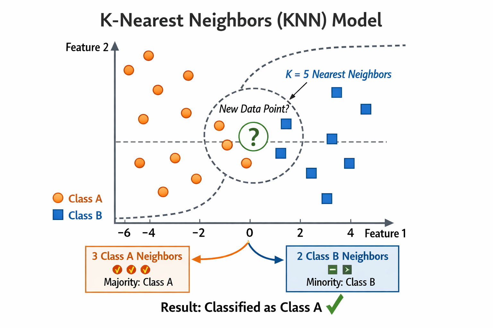
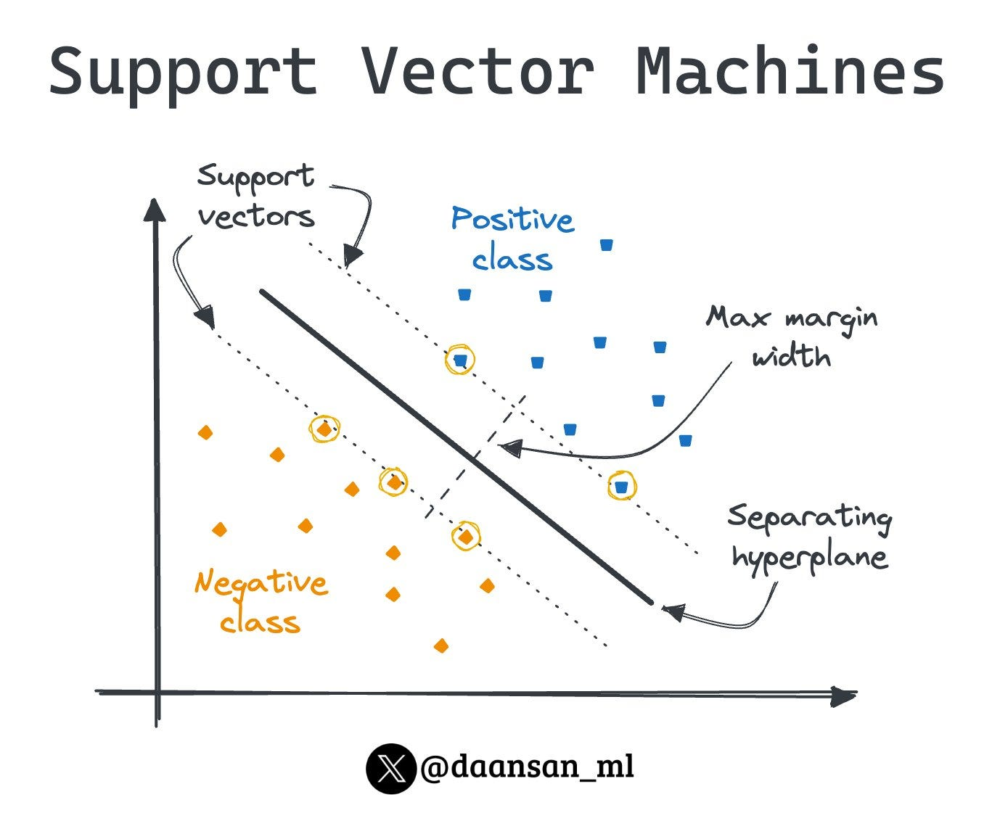

# Linear Regression in Machine Learning 📈

## What is Linear Regression? 🤔

**Linear Regression** is one of the simplest and most fundamental supervised machine learning algorithms. It is used to predict a **continuous numerical value** (the target or dependent variable) based on one or more **input features** (independent variables).

### Real-world Examples:
- Predicting house prices 🏠:   based on size, location, and number of rooms
- Forecasting sales 💰:         based on advertising spend
- Estimating student grades 📚: based on study hours

The core idea: **Find the best straight line (or hyperplane in higher dimensions)** that fits the data points as closely as possible.

---

## How Does Linear Regression Work? 🔍

Linear Regression assumes a **linear relationship** between the input features and the output. It tries to model this relationship using a straight line equation.

For a single feature (Simple Linear Regression):
- The model draws a line through the data points.
- The goal is to **minimize the distance** between the actual data points and the predicted line.

For multiple features (Multiple Linear Regression):
- It finds a hyperplane that best fits the data in higher-dimensional space.

---

## The Main Formula 📐

### Simple Linear Regression:
$$
y = \beta_0 + \beta_1 x + \epsilon
$$

Where:
- $y$ = predicted value (target)
- $x$ = input feature
- $\beta_0$ = **intercept** (where the line crosses the y-axis)
- $\beta_1$ = **slope** (how much $y$ changes when $x$ increases by 1)
- $\epsilon$ = error term (random noise)

### Multiple Linear Regression (General Form):
$$
y = \beta_0 + \beta_1 x_1 + \beta_2 x_2 + \dots + \beta_n x_n + \epsilon
$$

In vector notation:
$$
\hat{y} = \mathbf{X} \boldsymbol{\beta}
$$

---

## The Cost Function: Mean Squared Error (MSE) 📉

To measure how well the line fits the data, we use the **Mean Squared Error (MSE)**.

### Formula:
$$
\text{MSE} = \frac{1}{m} \sum_{i=1}^{m} (y_i - \hat{y}_i)^2
$$

Where:
- $m$ = number of training examples
- $y_i$ = actual value
- $\hat{y}_i$ = predicted value

**Why squared?**
- Squaring removes negative signs
- Penalizes large errors more heavily (outliers have bigger impact)
- Makes the function differentiable (smooth curve)

The lower the MSE, the better the model fits the data. Our goal during training is to **minimize the MSE**.

---

## The Learning Process: Finding the Best Parameters 🧠

There are two main ways to find the optimal values of $\beta_0, \beta_1, \dots$:

### 1. Normal Equation (Closed-Form Solution) ⚡

This is a **direct mathematical solution** that gives the optimal parameters in one step.

#### Formula:
$$
\boldsymbol{\beta} = (\mathbf{X}^T \mathbf{X})^{-1} \mathbf{X}^T \mathbf{y}
$$

**Advantages** ✅:
- No need to choose learning rate
- No iterations — computes result directly
- Exact solution (if matrix is invertible)

**Disadvantages** ❌:
- Very slow for large datasets (requires matrix inversion — $O(n^3)$ complexity)
- Can be numerically unstable with many features
- Doesn't work well if features are highly correlated

---

### 2. Gradient Descent (Iterative Optimization) 🚀

This is the most popular method, especially for large datasets.

#### How it Works:
1. Start with random values for parameters ($\beta$)
2. Calculate the **gradient** (slope) of the MSE with respect to each parameter
3. Update parameters by moving in the **opposite direction** of the gradient
4. Repeat until convergence

#### Update Rule:
$$
\beta_j := \beta_j - \alpha \frac{\partial}{\partial \beta_j} \text{MSE}
$$

Where:
- $\alpha$ = **Learning Rate** (how big a step to take)
  - Too small → slow convergence
  - Too large → may overshoot or diverge

#### Types of Gradient Descent:
- **Batch Gradient Descent**: Uses entire dataset per update (stable but slow)
- **Stochastic Gradient Descent (SGD)**: Uses one example per update (fast but noisy)
- **Mini-batch Gradient Descent**: Uses small batch (best of both worlds — most commonly used)

---

---

## Regularization: Preventing Overfitting 🛡️

**Regularization** is a technique used to reduce model complexity and prevent **overfitting** (when the model learns noise in the training data instead of the real pattern). It does this by adding a **penalty term** to the cost function, which discourages extremely large coefficients.

### Why Do We Need Regularization?
- Linear models can become too sensitive to small changes in the data when there are many features or multicollinearity.
- Regularization keeps the model simpler and improves generalization to new data.

The regularized cost function becomes:
$$
\text{Regularized MSE} = \text{MSE} + \lambda \times \text{Penalty}
$$
where $\lambda$ (lambda) is the **regularization strength** (hyperparameter).

---

### Types of Regularization

#### 1. L1 Regularization (Lasso) 🧩
**Lasso** (Least Absolute Shrinkage and Selection Operator) adds the **absolute value** of the coefficients as penalty.

**Penalty Term:**
$$
\lambda \sum_{j=1}^{n} |\beta_j|
$$

**Full Cost Function:**
$$
J(\boldsymbol{\beta}) = \frac{1}{m} \sum_{i=1}^{m} (y_i - \hat{y}_i)^2 + \lambda \sum_{j=1}^{n} |\beta_j|
$$

**Key Characteristics:**
- Can shrink some coefficients **exactly to zero** → performs **automatic feature selection**
- Useful when you have many irrelevant features
- Creates **sparse** models

#### 2. L2 Regularization (Ridge) 📏
**Ridge Regression** adds the **squared** value of the coefficients as penalty.

**Penalty Term:**
$$
\lambda \sum_{j=1}^{n} \beta_j^2
$$

**Full Cost Function:**
$$
J(\boldsymbol{\beta}) = \frac{1}{m} \sum_{i=1}^{m} (y_i - \hat{y}_i)^2 + \lambda \sum_{j=1}^{n} \beta_j^2
$$

**Key Characteristics:**
- Shrinks coefficients toward zero but **never exactly to zero**
- Handles multicollinearity well
- More stable than Lasso when features are correlated

#### 3. Elastic Net Regularization 🔀
Combines both L1 and L2 regularization.

**Penalty Term:**
$$
\lambda_1 \sum_{j=1}^{n} |\beta_j| + \lambda_2 \sum_{j=1}^{n} \beta_j^2
$$

**Full Cost Function:**
$$
J(\boldsymbol{\beta}) = \text{MSE} + \lambda_1 \|\boldsymbol{\beta}\|_1 + \lambda_2 \|\boldsymbol{\beta}\|_2^2
$$

**When to Use:**
- Best of both worlds: feature selection (L1) + stability (L2)
- Especially powerful when you have **more features than samples** or highly correlated features

---

## Polynomial Regression 📐➡️🔄

**Polynomial Regression** is an extension of Linear Regression that models **non-linear relationships** by adding polynomial features.

Even though the relationship between features and target is non-linear, the model is still **linear in terms of coefficients** — that’s why it’s called “polynomial linear regression.”

### How It Works
1. Create new features by raising existing features to higher powers.
2. Treat these new features as additional inputs to a linear model.

### Formula (Degree 2 Example):
$$
y = \beta_0 + \beta_1 x + \beta_2 x^2 + \epsilon
$$

For multiple features and higher degree $d$:
$$
y = \beta_0 + \beta_1 x + \beta_2 x^2 + \dots + \beta_d x^d + \epsilon
$$

### Example Transformation
Original feature: $x$

After polynomial transformation (degree = 2):
- New features: $[1, x, x^2]$

You can then apply normal Linear Regression (including regularization) on these new features.

### Important Notes ⚠️
- **Higher degree = more flexible** but also higher risk of **overfitting**
- Always combine with **Regularization** (Ridge or Lasso) when using high-degree polynomials
- Use techniques like **cross-validation** to choose the best polynomial degree
- Can be extended to multiple variables (e.g., $x_1^2$, $x_1x_2$, $x_2^2$, etc.)

---

## Quick Comparison

| Technique              | Best For                        | Handles Non-linearity | Feature Selection |
|------------------------|---------------------------------|-----------------------|-------------------|
| Linear Regression      | Simple linear data              | No                    | No                |
| Polynomial Regression  | Curved relationships            | Yes                   | No                |
| Lasso (L1)             | Many irrelevant features        | -                     | Yes               |
| Ridge (L2)             | Correlated features             | -                     | No                |
| Elastic Net            | High-dimensional + correlated   | -                     | Yes               |

---

# Logistic Regression in Machine Learning 📊

## What is Logistic Regression? 🤖

**Logistic Regression** is a supervised machine learning algorithm primarily used for **classification tasks**. While its name contains “Regression”, it is actually a **classification model** that predicts the probability of an instance belonging to a particular class.

### Common Use Cases:
- Spam detection (Spam / Not Spam) 📧
- Disease diagnosis (Sick / Healthy) 🏥
- Customer churn prediction (Will leave / Will stay) 📉
- Image classification (Cat / Dog) 🐱

Unlike Linear Regression, which predicts continuous values, Logistic Regression outputs **probabilities** between 0 and 1.

---

## The Sigmoid Function (Core Formula) 📉

Logistic Regression uses the **Sigmoid** (logistic) function to squash any real number into a probability range [0, 1].

### Sigmoid Formula:
$$
\sigma(z) = \frac{1}{1 + e^{-z}}
$$

Where:
- $z = \beta_0 + \beta_1 x_1 + \beta_2 x_2 + \dots + \beta_n x_n$ (linear combination of features, same as in linear regression)
- $\sigma(z)$ = predicted probability

**Interpretation**:
- If $\sigma(z) \geq 0.5$ → Predict class 1
- If $\sigma(z) < 0.5$ → Predict class 0

The decision boundary is usually at 0.5.

---

## Log Loss Function (Binary Cross-Entropy) 📉

To train the model, we minimize the **Log Loss** (also called Binary Cross-Entropy), which penalizes confident wrong predictions more heavily.

### Formula for Binary Log Loss:
$$
J(\boldsymbol{\beta}) = -\frac{1}{m} \sum_{i=1}^{m} \left[ y_i \log(\hat{y}_i) + (1 - y_i) \log(1 - \hat{y}_i) \right]
$$

Where:
- $y_i$ = actual label (0 or 1)
- $\hat{y}_i$ = predicted probability

**Why Log Loss?**
- Convex function → has a global minimum
- Works well with Gradient Descent
- Encourages the model to output probabilities close to the true labels

---

## Multinomial Logistic Regression (Multi-Class) 🔢

When you have **more than two classes**, we extend binary Logistic Regression to handle multiple classes.

### Two Main Strategies:

#### 1. One-vs-Rest (OvR) or One-vs-All (OvA) 🆚
- Train **one binary classifier per class**.
- For each classifier, treat the current class as positive and all others as negative.
- At prediction time: Choose the class with the **highest probability**.

**Advantages**: Simple and efficient  
**Disadvantages**: Can suffer from class imbalance issues

#### 2. One-vs-One (OvO) 🔄
- Train a binary classifier for **every pair of classes**.
- For $K$ classes, you need $\frac{K(K-1)}{2}$ classifiers.
- At prediction time: Use majority voting among all classifiers.

**Advantages**: Better for datasets with many classes  
**Disadvantages**: Computationally expensive (many models)

---

## Softmax Function 🧠

For true **multinomial logistic regression**, we use the **Softmax** function to generalize the sigmoid to multiple classes.

### Softmax Formula:
$$
\text{Softmax}(z_i) = \frac{e^{z_i}}{\sum_{j=1}^{K} e^{z_j}}
$$

Where:
- $z_i$ = linear score for class $i$
- $K$ = total number of classes

**How it Works**:
- Takes a vector of raw scores (logits) and converts them into probabilities that sum to 1.
- Emphasizes the largest score while keeping others positive.
- Perfect for mutually exclusive classes.

**Example**:
If raw scores for 3 classes = [2.0, 1.0, 0.1]  
→ Softmax outputs ≈ [0.66, 0.24, 0.10] (probabilities)

The full model then becomes:
$$
P(y = k | \mathbf{x}) = \text{Softmax}(z_k)
$$

cross- Entroopy Loss
$$ J(w) = \frac{-1}{m} \sum_{i=1}^{m} \sum_{k=1}^{K} y_k^{(i)} \cdot log(\hat{p}_k^{(i)}) $$

---

## Training with Gradient Descent
Just like Linear Regression, we use **Gradient Descent** to minimize the Log Loss (or Cross-Entropy Loss) by updating the coefficients $\beta$.

---

# K-Nearest Neighbors (KNN) in Machine Learning 👥

## What is KNN? 🤔

**K-Nearest Neighbors (KNN)** is a simple, intuitive, and **non-parametric** supervised learning algorithm used for both **classification** and **regression** tasks.

It belongs to the family of **instance-based** or **lazy learning** algorithms because it doesn’t learn a model during training. Instead, it simply **memorizes** the entire training dataset and makes predictions at runtime.

### Common Use Cases:
- Handwriting recognition ✍️
- Recommendation systems (similar users/items) ⭐
- Image classification 🖼️
- Anomaly detection 🔍
- Medical diagnosis (based on similar patients) 🏥

---

## How Does KNN Work? 🔄

KNN follows a very straightforward process:

### Step-by-Step Process:

1. **Store all training data** (no explicit training phase).
2. **Receive a new data point** to predict.
3. **Calculate the distance** between the new point and **every point** in the training set.
4. **Find the K closest neighbors** (smallest distances).
5. **Make a prediction**:
   - **Classification**: Take the **majority vote** of the K neighbors.
   - **Regression**: Take the **average** (or weighted average) of the K neighbors’ values.

### Distance Metrics 📏
The most common ways to measure “nearness”:

- **Euclidean Distance** (most popular):
  $$
  d(\mathbf{x}, \mathbf{y}) = \sqrt{\sum_{i=1}^{n} (x_i - y_i)^2}
  $$

- **Manhattan Distance**:
  $$
  d(\mathbf{x}, \mathbf{y}) = \sum_{i=1}^{n} |x_i - y_i|
  $$

- **Minkowski Distance** (general form)
- **Cosine Similarity** (good for text/high-dimensional data)

---

## Choosing the Right K ⚖️

- **Small K** (e.g., K=1): More sensitive to noise → can lead to **overfitting**
- **Large K**: Smoother decision boundary → can lead to **underfitting**

**Tips for choosing K**:
- Usually try odd numbers (to avoid ties in voting)
- Use **cross-validation** to find the optimal K
- Rule of thumb: Start with K = √(number of samples)

---

## Advantages ✅
- Very **simple and easy to understand**
- No assumptions about data distribution (non-parametric)
- Works well with **non-linear** decision boundaries
- Can be used for both classification and regression
- Naturally handles multi-class problems

---

## Disadvantages ❌
- **Computationally expensive** at prediction time (calculates distance to all points)
- Sensitive to **irrelevant or unscaled features** (always scale your data!)
- Suffers from **Curse of Dimensionality** — performance drops in very high dimensions
- Needs a lot of memory (stores all training data)
- Not good with imbalanced datasets unless modified

---

# Naive Bayes in Machine Learning 📧

## What is Naive Bayes? 🤓

**Naive Bayes** is a family of simple yet powerful **probabilistic classifiers** based on **Bayes’ Theorem**. Despite its simplicity, it often performs surprisingly well in real-world applications, especially in text-related tasks.

It is called **"Naive"** because it makes a strong (and often unrealistic) assumption: **all features are conditionally independent** given the class label.

### Common Use Cases:
- Spam detection (Spam / Not Spam) 📧
- Sentiment analysis (Positive / Negative) 😊
- Document classification / Topic modeling 📄
- Medical diagnosis 🏥
- Recommendation systems

**Key Advantages**:
- Extremely fast to train and predict
- Works well with high-dimensional data (e.g., text with thousands of words)
- Requires small amount of training data
- Handles both continuous and discrete data

---

## How Does Naive Bayes Work? 🔍

Naive Bayes applies **Bayes’ Theorem** to compute the probability of a class given the features.

### Bayes’ Theorem:
$$
P(A|B) = \frac{P(B|A) \cdot P(A)}{P(B)}
$$

In classification terms:
$$
P(\text{Class} | \text{Features}) = \frac{P(\text{Features} | \text{Class}) \cdot P(\text{Class})}{P(\text{Features})}
$$

Because of the **naive independence assumption**, the joint probability of features is simplified:
$$
P(x_1, x_2, \dots, x_n | C) \approx \prod_{i=1}^{n} P(x_i | C)
$$

**Prediction Rule**: Choose the class with the **highest posterior probability**.

---

## Types of Naive Bayes Classifiers 📊

Different variants are used depending on the type of features:

### 1. Gaussian Naive Bayes 🌡️
Used when features are **continuous** and assumed to follow a **normal (Gaussian) distribution**.

**Probability Density**:
$$
P(x_i | C) = \frac{1}{\sqrt{2\pi\sigma_C^2}} \exp\left( -\frac{(x_i - \mu_C)^2}{2\sigma_C^2} \right)
$$

Where $\mu_C$ and $\sigma_C$ are the mean and variance of feature $x_i$ for class $C$.

**Best for**: Real-valued data (e.g., height, weight, temperature).

### 2. Multinomial Naive Bayes 📝
Used for **discrete count data** (especially text data with word frequencies).

It models the frequency of words appearing in documents.

**Very popular for**:
- Document classification
- Sentiment analysis
- TF-IDF features

### 3. Bernoulli Naive Bayes 📌
Used for **binary / boolean features** (e.g., word appears or not in a document).

It considers only whether a feature is present or absent, not the count.

**Best for**: Binary feature vectors (e.g., spam detection with word presence).

### 4. Complement Naive Bayes (CNB)
An improvement over Multinomial NB that is particularly effective for **imbalanced datasets**.

---

## Training and Prediction Process ⚙️

1. **Training**:
   - Calculate the prior probability $P(C)$ for each class.
   - Calculate the likelihood $P(x_i | C)$ for each feature given the class.

2. **Prediction**:
   - For a new sample, compute the posterior probability for every class.
   - Pick the class with the **maximum posterior**.

---

## Advantages ✅
- Very fast and scalable
- Good with missing data
- Easy to interpret (probabilities)
- Performs well even when independence assumption is violated

---

## Disadvantages ❌
- **Strong independence assumption** is rarely true in real data
- Can be outperformed by more complex models (trees, neural nets)
- Zero probability problem (solved by **Laplace Smoothing**)

**Laplace Smoothing** (Additive Smoothing):
$$
P(x_i | C) = \frac{\text{count}(x_i, C) + \alpha}{\text{count}(C) + \alpha \cdot n}
$$

---

# Support Vector Machine (SVM) in Machine Learning ⚔️

## What is Support Vector Machine? 🤖

**Support Vector Machine (SVM)** is a powerful supervised learning algorithm used for both **classification** and **regression** tasks. It is particularly effective in high-dimensional spaces and is known for its strong generalization capabilities.

The main idea behind SVM is to find the **optimal decision boundary** (a hyperplane) that separates different classes with the **maximum possible margin**. This makes the model more robust to new, unseen data.

### Common Use Cases:
- Image classification 🖼️
- Text categorization (e.g., sentiment analysis) 📝
- Handwriting recognition ✍️
- Bioinformatics (protein classification) 🧬
- Face detection 👤

---

## How Does SVM Work? 🔍

SVM works by solving an **optimization problem** with the following key concepts:

1. **Hyperplane**: A flat decision boundary that separates classes. In 2D it’s a line, in 3D it’s a plane, and in higher dimensions it’s a hyperplane.

2. **Margin**: The distance between the hyperplane and the closest data points from each class. SVM tries to **maximize this margin**.

3. **Support Vectors**: The data points that lie closest to the hyperplane. These are the most critical points — removing them would change the position of the hyperplane. They literally “support” the decision boundary.

4. **Handling Non-Linear Data (Kernel Trick)** ✨:
   - Many real-world datasets are not linearly separable.
   - SVM uses the **Kernel Trick** to implicitly map the data into a higher-dimensional space where it becomes linearly separable, without actually computing the expensive coordinates.
   - Popular kernels: Linear, Polynomial, RBF (Radial Basis Function / Gaussian), Sigmoid.

**Intuition**: Imagine trying to separate two groups of points with a line. SVM finds the widest street (margin) between them so that even if new points appear, they are less likely to be misclassified.

---

## Advantages ✅
- Excellent performance in high-dimensional data
- Robust to overfitting (especially with proper regularization)
- Works well with small to medium-sized datasets
- Versatile thanks to different kernel functions

## Disadvantages ❌
- Can be slow on very large datasets (training time is higher)
- Sensitive to choice of kernel and hyperparameters
- Less interpretable compared to trees or logistic regression
- Requires feature scaling

---

## Support Vector Regression (SVR) 📈

**Support Vector Regression (SVR)** is the **regression version** of SVM. Instead of finding a hyperplane that separates classes, SVR finds a hyperplane that best fits the data within a certain margin of tolerance.

### How SVR Works:
- It tries to find a function that predicts continuous values while allowing some errors.
- It defines an **ε-tube** (epsilon-insensitive tube) around the regression line. Errors inside this tube are ignored (treated as zero).
- Points outside the tube are penalized using **slack variables**.
- The goal is to have a flat function (small coefficients) while keeping as many points as possible inside the ε-tube.

**Key Difference from Standard Regression**:
- Ordinary regression (like Linear Regression) minimizes the error for every point.
- SVR focuses on keeping errors within a certain threshold and maximizes the “flatness” of the function.

SVR inherits all the strengths of SVM: it can handle non-linear relationships using kernels and is robust to outliers thanks to the margin-based approach.

---

---

# Decision Trees in Machine Learning 🌳

## What is a Decision Tree? 🤔

**Decision Tree** is a versatile, tree-like supervised learning algorithm that can be used for both **classification** and **regression** tasks. It makes decisions by asking a series of "if-else" questions about the features, splitting the data step by step until it reaches a final prediction.

Think of it as a flowchart:
- Each **internal node** represents a **decision** (feature + threshold).
- Each **branch** represents an outcome of the decision.
- Each **leaf node** represents a **final prediction** (class label or numerical value).

### Common Use Cases:
- Customer churn prediction 📉
- Loan approval decisions 💰
- Medical diagnosis 🏥
- Game AI (e.g., chess moves) ♟️

**Why popular?** Highly interpretable — you can literally visualize and follow the decision path.

---

## How Does a Decision Tree Work? 🔀

1. **Start at the root node** with the full dataset.
2. **Choose the best feature** and split point that best separates the data (using a criterion like MSE or Gini/Entropy).
3. **Recursively split** each resulting subset into smaller groups.
4. **Stop splitting** when a stopping condition is met (max depth, minimum samples per leaf, no improvement, etc.).
5. **Pruning** (optional): Remove branches that don’t improve performance on validation data to reduce overfitting.

The algorithm is **greedy** — at each step it chooses the locally best split without looking ahead globally.

---

## Decision Trees for Regression 📈 (Using MSE)

In regression, the tree predicts a **continuous value**. At each split, it chooses the feature and threshold that **minimizes the Mean Squared Error (MSE)** in the resulting child nodes.

### Splitting Criterion:
The algorithm calculates the weighted average of MSE in the left and right child nodes and picks the split that gives the **biggest reduction** in total MSE.

**Leaf Prediction**: Usually the **average** value of all samples in that leaf.

This creates piecewise constant predictions — the output is constant within each region defined by the splits.

---

## Decision Trees for Classification 📊 (Entropy & Gini)

In classification, the goal is to create **pure nodes** (nodes where all samples belong to the same class). Two popular criteria are used to measure impurity:

### 1. Entropy (Information Gain) 📏

**Entropy** measures the level of disorder or uncertainty in a node.

#### Formula:
$$
\text{Entropy}(S) = -\sum_{i=1}^{c} p_i \log_2(p_i)
$$

Where:
- $c$ = number of classes
- $p_i$ = proportion of samples belonging to class $i$

**Interpretation**:
- Entropy = 0 → Perfectly pure node (all samples same class)
- Entropy = 1 (for binary) → Maximum impurity (50/50 split)

The tree chooses splits that result in the **highest Information Gain** (biggest reduction in entropy).

### 2. Gini Impurity 🎲

**Gini** is a simpler and faster alternative to Entropy.

#### Formula:
$$
\text{Gini}(S) = 1 - \sum_{i=1}^{c} p_i^2
$$

Where $p_i$ is the proportion of class $i$.

**Interpretation**:
- Gini = 0 → Pure node
- Higher value → More impure

Gini is often preferred in practice (e.g., in scikit-learn’s default) because it is computationally faster than Entropy (no logarithms).

---

## Advantages ✅
- Easy to understand and visualize
- Handles both numerical and categorical data
- Requires little data preprocessing (no scaling needed)
- Can capture non-linear relationships
- Feature importance can be extracted

---

## Disadvantages ❌
- Prone to **overfitting** (very deep trees)
- Unstable — small changes in data can lead to very different trees
- Biased toward features with more categories
- Poor performance on very high-dimensional sparse data

**Tip**: Use **Random Forest** (ensemble of many decision trees) to overcome most of these weaknesses.

---

# Ensemble Learning in Machine Learning 🤝

**Ensemble Learning** is a powerful technique that combines multiple individual models (called **base learners**) to create a single, stronger predictive model. The main idea is that "the wisdom of the crowd" often outperforms any single expert.

**Why Ensembles Work:**
- Reduce variance (e.g., Random Forest)
- Reduce bias (e.g., Boosting methods)
- Improve overall accuracy and robustness
- Help avoid overfitting

---

## Random Forest 🌲🌲🌲

**Random Forest** is an **ensemble of Decision Trees** that uses **Bagging** (Bootstrap Aggregating) + feature randomness.

### How Random Forest Works:
1. **Bootstrap Sampling**: Create multiple random subsets of the training data (with replacement). Each subset is used to train one decision tree.
2. **Feature Randomness**: At each split in a tree, only a random subset of features is considered (instead of all features). This makes trees more diverse.
3. **Aggregation**:
   - **Classification**: Majority vote across all trees.
   - **Regression**: Average of all trees' predictions.

### Key Benefits:
- Much more stable and accurate than a single decision tree
- Reduces overfitting significantly
- Provides **feature importance** scores naturally
- Works well out-of-the-box with minimal tuning

**Intuition**: Many different trees "vote" on the answer. Because they are trained on different data and features, their errors tend to cancel out.

---

## Gradient Boosting Machines (GBM) 🚀

**Gradient Boosting** is a **sequential ensemble** technique where each new model tries to correct the errors of the previous ones.

### How Gradient Boosting Works:
1. Start with a simple base model (usually a shallow decision tree) that makes initial predictions.
2. Calculate the **residuals** (errors) of the current ensemble.
3. Train a new weak model (tree) to predict these residuals.
4. Add the new model to the ensemble with a **learning rate** (shrinkage) to control how much it contributes.
5. Repeat the process for many iterations (hundreds or thousands of trees).

Each new tree is fitted to the **negative gradient** of the loss function (hence "Gradient" Boosting). This is like moving downhill on the error surface step by step.

**Popular Implementations**:
- XGBoost (extremely popular and optimized)
- LightGBM
- CatBoost

**Strengths**: Often achieves state-of-the-art performance on tabular data.  
**Weakness**: More prone to overfitting if not properly regularized (use early stopping, learning rate, etc.).

---

## Adaptive Boosting (AdaBoost) 📈

**AdaBoost** (Adaptive Boosting) is one of the earliest and simplest boosting algorithms.

### How AdaBoost Works:
1. Start by training a weak classifier (often a shallow decision tree or even a decision stump — tree with one split).
2. Assign **equal weights** to all training samples initially.
3. After each model is trained:
   - Increase the weights of **misclassified** samples (so the next model focuses more on hard examples).
   - Decrease the weights of correctly classified samples.
4. The next weak learner is trained on this re-weighted dataset.
5. Each model gets a **voting weight** based on its accuracy (better models have more influence in the final decision).
6. Final prediction is a **weighted vote** of all weak learners.

**Key Idea**: Focus on the mistakes of previous models by adaptively changing sample importance.

---

## Quick Comparison of Ensemble Methods

| Method              | Approach          | Focus                  | Speed     | Performance |
|---------------------|-------------------|------------------------|-----------|-------------|
| Random Forest       | Bagging + Parallel| Reduce variance        | Fast      | Very Good   |
| Gradient Boosting   | Sequential Boosting | Reduce bias + variance | Medium    | Excellent   |
| AdaBoost            | Sequential Boosting | Focus on hard examples | Fast      | Good        |

---

## Summary 🎯

Ensemble methods are among the most effective tools in a data scientist’s toolkit.  
- **Random Forest** → Great default choice for robustness  
- **Gradient Boosting** → Top performer on structured/tabular data  
- **AdaBoost** → Simple but powerful focus on difficult examples

These methods turn weak learners into strong ones and are widely used in competitions and production systems.

---

# XGBoost and LightGBM in Machine Learning ⚡

## XGBoost (Extreme Gradient Boosting) 🚀

**XGBoost** is an optimized and highly efficient implementation of **Gradient Boosting Machines (GBM)**. It has become one of the most popular algorithms in machine learning competitions (Kaggle, etc.) and real-world applications due to its speed and performance.

### How XGBoost Works:
1. Builds trees **sequentially**, just like standard Gradient Boosting.
2. Each new tree is trained to correct the **residual errors** (negative gradients) of the previous ensemble.
3. Introduces several key improvements over classic GBM:
   - **Regularization**: Adds L1 and L2 penalties on leaf weights to control overfitting.
   - **Tree Pruning**: Uses a more sophisticated approach (max depth + pruning) instead of stopping at a fixed depth.
   - **Handling Missing Values**: Automatically learns the best direction for missing values.
   - **Weighted Quantile Sketch**: Efficiently finds optimal split points.
   - **Parallel Processing**: Supports multi-threading and distributed computing.
   - **Column Subsampling**: Like Random Forest, samples features for diversity.

**Key Innovations**:
- Uses a second-order approximation (Taylor expansion) of the loss function for faster and more accurate splits.
- Cache-aware access and out-of-core computation for very large datasets.

**Strengths** ✅:
- Excellent predictive power
- Built-in regularization reduces overfitting
- Very fast training with parallelization
- Feature importance scores out-of-the-box

---

## LightGBM (Light Gradient Boosting Machine) 🌟

**LightGBM**, developed by Microsoft, is a highly efficient gradient boosting framework designed for **speed and scalability**, especially on large datasets with many features.

### How LightGBM Works:
It follows the same **sequential boosting** principle as XGBoost but introduces groundbreaking optimizations:

1. **Histogram-based Splitting**:
   - Instead of checking every possible split point, it buckets continuous features into discrete bins (histograms). This dramatically reduces computation time.

2. **Leaf-wise Tree Growth** (vs Level-wise):
   - Traditional trees grow level by level.
   - LightGBM grows the **leaf with the highest loss reduction** first. This leads to deeper, more accurate trees while being more efficient.

3. **Gradient-based One-Side Sampling (GOSS)**:
   - Keeps instances with large gradients (hard examples) and randomly samples instances with small gradients. This focuses computation on important data.

4. **Exclusive Feature Bundling (EFB)**:
   - Bundles mutually exclusive features (features that rarely take non-zero values together) to reduce dimensionality.

### Key Advantages of LightGBM:
- Extremely **fast training** and low memory usage
- Excellent for **large datasets** and high-dimensional data
- Supports **categorical features** natively (no one-hot encoding needed)
- Highly scalable with distributed learning

**Trade-off**: Leaf-wise growth can sometimes lead to overfitting if not properly regularized (use `num_leaves`, `min_data_in_leaf`, etc.).

---

## Quick Comparison: XGBoost vs LightGBM

| Feature                  | XGBoost                  | LightGBM                     |
|--------------------------|--------------------------|------------------------------|
| Speed                    | Very Fast                | **Extremely Fast**           |
| Memory Usage             | Moderate                 | **Lower**                    |
| Tree Growth              | Level-wise               | **Leaf-wise**                |
| Best For                 | Balanced performance     | Large-scale & high-dimensional data |
| Categorical Features     | Requires encoding        | **Native support**           |
| Popularity               | Extremely High           | Rapidly growing              |

---

## Summary 🎯

- **XGBoost**: The "go-to" optimized gradient boosting algorithm — powerful, reliable, and battle-tested.
- **LightGBM**: The speed king — designed for massive datasets while maintaining high accuracy.

Both are **state-of-the-art** for tabular/structured data and often outperform neural networks on non-image tasks when used properly. They are usually the top contenders in machine learning competitions.

---

# Stacking (Stacked Generalization) in Machine Learning 🥞

## What is Stacking? 🤖

**Stacking** (short for Stacked Generalization) is an advanced **ensemble learning** technique that combines multiple different base models (called **level-0 models**) using a **meta-learner** (level-1 model) to achieve better predictive performance than any single model alone.

Unlike Random Forest (bagging) or Gradient Boosting (sequential), stacking focuses on **learning the best way to combine** diverse models by training a higher-level model on their predictions.

It is one of the most powerful ensemble methods and is frequently used in machine learning competitions to squeeze out extra performance.

---

## How Does Stacking Work? 🔄

Stacking involves two main stages:

### Stage 1: Train Base Models (Level-0)
1. Choose several **diverse** base models (e.g., Random Forest, XGBoost, SVM, Neural Network, KNN, etc.).
2. Train each base model on the training data.
3. Generate **predictions** from each base model. These predictions become the **new features** for the next level.

**Important**: To avoid overfitting, base model predictions on the training set are usually generated using **cross-validation** (e.g., 5-fold CV). Each fold’s out-of-fold predictions are used to train the meta-learner.

### Stage 2: Train the Meta-Learner (Level-1)
1. Use the predictions from the base models as **input features**.
2. Train a meta-model (often a simple model like Logistic Regression, Linear Regression, or a small Gradient Boosting model) on these predictions to learn how to best combine them.
3. The meta-learner learns which base models are more trustworthy for different types of data points.

### Final Prediction
- For a new test sample:
  - Get predictions from all base models.
  - Feed those predictions into the trained meta-learner.
  - The meta-learner outputs the final prediction.

---

## Advantages ✅
- Can combine the strengths of very different algorithms
- Often achieves higher accuracy than individual models or simpler ensembles
- Meta-learner learns the optimal blending strategy
- Very flexible — you can stack any models

## Disadvantages ❌
- More complex to implement and tune
- Higher risk of overfitting if not using proper cross-validation
- Longer training time (multiple models + meta-model)
- Less interpretable than single models.

---

## Summary 🎯

**Stacking** is a meta-ensemble technique that trains a model to learn the best combination of predictions from multiple diverse base learners. It is more sophisticated than bagging or boosting and often delivers top-tier performance when implemented carefully.

It’s the “final boss” of traditional ensemble methods — many winning solutions in competitions use some form of stacking.

---

# Dimension Reduction in Machine Learning 📉

**Dimensionality Reduction** refers to techniques that reduce the number of input features (dimensions) while preserving as much important information as possible. It helps with the **Curse of Dimensionality**, improves model performance, reduces computation time, and enables visualization of high-dimensional data.

---

## Principal Component Analysis (PCA) 🔄

**PCA** is the most popular linear dimensionality reduction technique. It transforms the original features into a new set of **uncorrelated variables** called **Principal Components**, ordered by the amount of variance they explain.

### How PCA Works (Linear Algebra Perspective) 🧮

1. **Standardize the Data**: Center the data (subtract mean) so each feature has zero mean. (Optional: scale to unit variance).

2. **Compute the Covariance Matrix**:
   $$
   \Sigma = \frac{1}{n-1} X^T X
   $$
   This matrix captures how features vary together.

3. **Eigen Decomposition**:
   - Find the **eigenvectors** and **eigenvalues** of the covariance matrix.
   - Eigenvectors represent the directions (new axes) of maximum variance.
   - Eigenvalues represent the amount of variance explained by each eigenvector.

4. **Select Principal Components**:
   - Sort eigenvectors by their eigenvalues (largest to smallest).
   - Choose the top $k$ eigenvectors (where $k$ is the desired number of dimensions).

5. **Project the Data**:
   $$
   X_{\text{new}} = X \cdot W
   $$
   Where $W$ is the matrix of selected eigenvectors.

**Key Concepts**:
- Principal components are **orthogonal** (perpendicular) to each other.
- The first principal component captures the **maximum variance**.
- The second captures the next highest variance while being orthogonal to the first, and so on.

**Advantages** ✅:
- Unsupervised (no need for labels)
- Linear and computationally efficient
- Reduces noise and redundancy

**Limitations** ❌:
- Linear only (cannot capture complex non-linear manifolds)
- Hard to interpret the new components

---

## Other Dimensionality Reduction Algorithms

### t-SNE (t-Distributed Stochastic Neighbor Embedding) 🌀
**t-SNE** is a **non-linear** technique primarily used for **visualization** (reducing to 2D or 3D).

- It models similarities between points using probability distributions.
- In high dimensions: Uses Gaussian distribution.
- In low dimensions: Uses Student’s t-distribution (heavier tails to avoid crowding).
- Minimizes the difference between these two distributions (using Kullback-Leibler divergence).

**Best for**: Exploring clusters and manifolds in data.  
**Drawbacks**: Not great for new data (no explicit mapping), computationally expensive, and results can vary between runs.

### UMAP (Uniform Manifold Approximation and Projection) 🌌
**UMAP** is a modern, fast, and scalable **non-linear** technique that often produces better visualizations than t-SNE while preserving more global structure.

- Based on **manifold learning** and topological data analysis.
- Constructs a high-dimensional graph of nearest neighbors, then optimizes a low-dimensional representation.
- Faster and more scalable than t-SNE.
- Supports both supervised and unsupervised modes.

**Strengths**: Better at preserving both local and global structure, faster, and consistent.

### LDA (Linear Discriminant Analysis) 🎯
**LDA** is a **supervised** dimensionality reduction technique.

- Unlike PCA (which maximizes variance), LDA maximizes **class separability**.
- Finds linear combinations of features that best separate multiple classes.
- Uses both within-class and between-class scatter matrices.
- Commonly used for classification preprocessing and face recognition (Fisherfaces).

**Best when**: You have labeled data and want to maximize discrimination between classes.

### LLE (Locally Linear Embedding) 🔗
**LLE** is a **non-linear** manifold learning method.

- Assumes data lies on a lower-dimensional manifold.
- For each point, it finds its nearest neighbors and reconstructs the point as a weighted linear combination of those neighbors.
- Then finds a low-dimensional embedding that preserves these local linear relationships.

**Strengths**: Good at unfolding manifolds (e.g., Swiss roll dataset).  
**Weaknesses**: Sensitive to noise and parameter choices.

---

## Quick Comparison

| Technique | Type       | Supervised | Best For                  | Speed     |
|-----------|------------|------------|---------------------------|-----------|
| PCA       | Linear     | No         | General reduction         | Very Fast |
| t-SNE     | Non-linear | No         | 2D/3D Visualization       | Slow      |
| UMAP      | Non-linear | Optional   | Visualization + Reduction | Fast      |
| LDA       | Linear     | Yes        | Classification            | Fast      |
| LLE       | Non-linear | No         | Manifold unfolding        | Medium    |

---

## When to Use Dimensionality Reduction? 💡
- Before training complex models on high-dimensional data
- For data visualization
- To remove noise and multicollinearity
- As a preprocessing step for distance-based algorithms (like KNN)

---

# K-Means Clustering in Machine Learning 🔀

## What is K-Means? 🤖

**K-Means** is one of the simplest and most popular **unsupervised** machine learning algorithms used for **clustering**. 

It groups similar data points together into **K clusters** (where K is a number you choose in advance) based on their feature similarity. The goal is to minimize the variance (spread) within each cluster while maximizing the separation between different clusters.

### Common Use Cases:
- Customer segmentation (grouping customers by behavior) 👥
- Image compression (reducing color palette) 🖼️
- Document clustering (grouping similar news/articles) 📄
- Anomaly detection (points far from any cluster center)
- Market segmentation and recommendation systems

---

## How Does K-Means Work? ⚙️

K-Means is an **iterative algorithm** that follows these steps:

### Step-by-Step Process:

1. **Choose K**: Decide the number of clusters you want (e.g., K=3).

2. **Initialize Centroids**: Randomly place K cluster centers (centroids) in the feature space.

3. **Assignment Step**:
   - For each data point, calculate its distance to all centroids.
   - Assign the point to the **nearest centroid** (usually using Euclidean distance).

4. **Update Step**:
   - For each cluster, recalculate the **centroid** as the **mean** (average) of all points assigned to that cluster.

5. **Repeat**:
   - Repeat steps 3 and 4 until one of the following happens:
     - Centroids stop moving (convergence)
     - Maximum number of iterations is reached
     - Assignments no longer change

The algorithm tries to **minimize the Within-Cluster Sum of Squares (WCSS)**, also known as **inertia**:

$$
\text{WCSS} = \sum_{i=1}^{K} \sum_{x \in C_i} \| x - \mu_i \|^2
$$

Where $\mu_i$ is the centroid of cluster $C_i$.

---

## Important Considerations ⚠️

- **Choosing the right K**: Use the **Elbow Method** (plot WCSS vs K and look for the "elbow" point) or **Silhouette Score**.
- **Sensitive to Initialization**: Bad initial centroids can lead to poor clusters. Use **K-Means++** (smart initialization) to improve results.
- **Assumptions**:
  - Clusters are roughly spherical and equally sized
  - Features should be scaled (standardization is important)
- **Hard Clustering**: Each point belongs to exactly one cluster.

---

## Advantages ✅
- Simple and easy to understand
- Very fast and scalable to large datasets
- Easy to implement and interpret

## Disadvantages ❌
- Must specify K in advance
- Sensitive to outliers (they can pull centroids)
- Assumes clusters are convex and isotropic
- Can get stuck in local optima
- Not suitable for non-spherical or varying density clusters

---

## Quick Summary 🎯

**K-Means** is a fast, intuitive clustering algorithm that partitions data into K groups by iteratively assigning points to the nearest centroid and updating centroids to the cluster mean. While simple, it remains a go-to algorithm for many real-world clustering tasks and serves as a strong baseline.

---

# Hierarchical Clustering in Machine Learning 🌳

## What is Hierarchical Clustering? 🤝

**Hierarchical Clustering** is an **unsupervised** machine learning algorithm that builds a hierarchy of clusters. Unlike K-Means, it does **not require** you to specify the number of clusters in advance. 

Instead, it creates a tree-like structure called a **dendrogram**, which shows how clusters are merged (or split) at different levels. You can then "cut" the dendrogram at a desired height to get the number of clusters you want.

### Common Use Cases:
- Customer segmentation 👥
- Gene expression analysis in biology 🧬
- Document and text clustering 📚
- Social network analysis
- Image segmentation 🖼️

---

## How Does Hierarchical Clustering Work? 🔄

There are two main approaches:

### 1. Agglomerative (Bottom-Up) Clustering — Most Common
- Starts with each data point as its own individual cluster.
- Repeatedly **merges** the two closest clusters until only one big cluster remains.
- This creates a hierarchy from small clusters to large ones.

### 2. Divisive (Top-Down) Clustering
- Starts with all data points in one single cluster.
- Repeatedly **splits** the most heterogeneous cluster into smaller ones until each point is in its own cluster.

**Agglomerative** is far more popular due to its simplicity and efficiency.

---

## The Merging Process (Linkage Criteria)

The key decision in hierarchical clustering is **how to measure the distance between two clusters** (not just individual points). Common linkage methods include:

- **Single Linkage** (Minimum distance): Distance between the closest points of two clusters.  
  → Can create long, chain-like clusters.

- **Complete Linkage** (Maximum distance): Distance between the farthest points of two clusters.  
  → Creates compact, spherical clusters.

- **Average Linkage**: Average distance between all pairs of points from the two clusters.  
  → Balanced approach.

- **Ward’s Linkage** (Most Popular): Minimizes the increase in **total within-cluster variance** after merging.  
  → Often produces the best and most balanced clusters.

---

## Dendrogram Visualization 📊

The result of hierarchical clustering is a **dendrogram** — a tree diagram that shows:
- Which clusters were merged at each step
- The distance (or dissimilarity) at which merges happened

You can cut the dendrogram horizontally at any height to obtain a specific number of clusters.

---

## Advantages ✅
- No need to specify number of clusters beforehand
- Provides a complete hierarchy (great for interpretation)
- Works with any distance metric
- Can reveal nested structures in data

## Disadvantages ❌
- Computationally expensive (usually $O(n^3)$ or $O(n^2)$ time) → not ideal for very large datasets
- Once a merge is done, it cannot be undone (greedy algorithm)
- Sensitive to outliers and noise
- Requires choosing a linkage method and distance metric carefully

---

## Quick Summary 🎯

**Hierarchical Clustering** builds a tree of clusters either by merging smaller ones (agglomerative) or splitting larger ones (divisive). It gives you maximum flexibility through the dendrogram and is excellent when you want to explore the natural grouping structure of your data at multiple levels of granularity.

It pairs very well with K-Means — you can use hierarchical clustering to decide the optimal number of clusters for K-Means.

---

# DBSCAN in Machine Learning 🟢

## What is DBSCAN? 🔍

**DBSCAN** (Density-Based Spatial Clustering of Applications with Noise) is a powerful **unsupervised** clustering algorithm that groups data points based on **density**.

Unlike K-Means or Hierarchical Clustering, DBSCAN:
- Does **not** require you to specify the number of clusters in advance
- Can discover clusters of **arbitrary shapes** (not just spherical)
- Automatically identifies and marks **outliers/noise** points

### Common Use Cases:
- Anomaly/outlier detection 🔍
- Spatial data analysis (geographical clustering) 🗺️
- Image segmentation
- Finding patterns in noisy real-world data
- Customer behavior clustering with irregular groups

---

## How Does DBSCAN Work? ⚙️

DBSCAN works by analyzing the **local density** of points. It classifies each point into one of three categories:

### Key Concepts:

1. **Core Point**:
   - A point that has at least **MinPts** (minimum points) neighbors within a radius **ε** (epsilon).
   - These are the "dense" centers of clusters.

2. **Border Point**:
   - A point that is within ε of a core point but has fewer than MinPts neighbors itself.
   - These lie on the edge of a cluster.

3. **Noise Point (Outlier)**:
   - A point that is neither a core point nor a border point.
   - These are ignored and not assigned to any cluster.

### The Clustering Process:

1. Pick an unvisited point from the dataset.
2. Check if it is a **core point** (has enough neighbors within ε).
3. If yes, start a new cluster and expand it by adding all **density-reachable** points.
4. **Density-Reachable**: You can travel from one core point to another by jumping through overlapping ε-neighborhoods.
5. **Density-Connected**: Points that are mutually reachable through core points belong to the same cluster.
6. Repeat until all points are visited.

The algorithm grows clusters by connecting dense regions and marks sparse areas as noise.

---

## Parameters ⚙️

- **ε (epsilon)**: The maximum distance between two points to be considered neighbors.
- **MinPts**: The minimum number of points required to form a dense region.

**Tips for choosing parameters**:
- Use **k-distance plot** (sort distances to k-th nearest neighbor) to find a good ε
- MinPts is often set to `2 * number_of_features` or higher

---

## Advantages ✅
- Excellent at handling **noise and outliers**
- Can find clusters with **complex, non-convex shapes**
- No need to specify number of clusters
- Works well with varying density (to some extent)

## Disadvantages ❌
- Sensitive to the choice of ε and MinPts
- Struggles with clusters of **vastly different densities**
- Not very scalable to extremely large high-dimensional datasets (though faster variants exist)
- Requires careful parameter tuning

---

## Quick Comparison with Other Clustering Algorithms

| Algorithm      | Needs K? | Shape     | Handles Noise | Arbitrary Shapes |
|----------------|----------|-----------|---------------|------------------|
| K-Means        | Yes      | Spherical | Poor          | No               |
| Hierarchical   | No       | Varies    | Moderate      | Moderate         |
| DBSCAN         | No       | Any       | Excellent     | Yes              |

---

---

# Neural Networks in Deep Learning 🧠

## What is a Neural Network? 🌐

A **Neural Network** (also called Artificial Neural Network or ANN) is a computational model inspired by the structure and functioning of the **human brain**. 

It is the foundation of **Deep Learning** — a subfield of machine learning that uses networks with many layers (hence "deep") to learn complex patterns from large amounts of data.

Neural networks excel at tasks where traditional algorithms struggle, such as:
- Image recognition 🖼️
- Natural language processing (NLP) 💬
- Speech recognition 🎤
- Game playing (AlphaGo) ♟️
- Generative AI (image and text generation)

---

## How Does a Neural Network Work? 🔄

A neural network processes data through interconnected **neurons** organized in **layers**.

### Basic Structure:

1. **Input Layer**: Receives the raw data (features). Each neuron represents one input feature.
2. **Hidden Layers**: One or more layers between input and output. This is where the "learning" happens. Deep Learning refers to networks with many hidden layers.
3. **Output Layer**: Produces the final prediction (class probabilities, numerical value, etc.).

Each connection between neurons has a **weight**, and each neuron has a **bias**.

### Step-by-Step Process (Forward Propagation):

1. **Weighted Sum**: Each neuron calculates a weighted sum of its inputs:
   $$
   z = \sum (w_i \cdot x_i) + b
   $$
   where $w_i$ = weights, $x_i$ = inputs, $b$ = bias.

2. **Activation Function**: The weighted sum is passed through a non-linear **activation function** to introduce complexity and allow the network to learn non-linear relationships.
   - Common activations: **ReLU** (most popular), Sigmoid, Tanh, Softmax (for classification).

3. **Forward Pass**: Data flows from input → hidden layers → output.

4. **Calculate Loss**: Compare the network’s prediction with the actual target using a **loss function** (e.g., MSE for regression, Cross-Entropy for classification).

---

## Training the Network: Backpropagation 📉

This is the core learning process:

1. **Forward Pass**: Make a prediction.
2. **Calculate Error**: Measure how wrong the prediction was.
3. **Backward Pass (Backpropagation)**:
   - Compute the **gradient** (derivative) of the loss with respect to each weight and bias using the **chain rule**.
   - This tells us how much each weight contributed to the error.
4. **Update Weights**: Use **Gradient Descent** (or advanced optimizers like Adam) to adjust weights in the direction that reduces the loss:
   $$
   w_{\text{new}} = w_{\text{old}} - \eta \cdot \frac{\partial L}{\partial w}
   $$
   where $\eta$ is the learning rate.

5. Repeat for many **epochs** (full passes through the training data) until the model converges.

---

## Key Concepts in Deep Learning 🧩

- **Deep Networks**: More hidden layers allow learning of hierarchical features (edges → shapes → objects in images).
- **Overfitting Risk**: Deep networks have millions of parameters and can easily memorize training data. Use regularization (Dropout, L2), early stopping, and large datasets.
- **Optimizers**: Adam, RMSprop, SGD with momentum.
- **Batch Processing**: Mini-batch gradient descent for efficiency.

---

## Advantages ✅
- Extremely powerful at learning complex, hierarchical patterns
- Automatic feature extraction (no need for manual engineering)
- State-of-the-art performance on perceptual tasks (vision, speech, text)

## Disadvantages ❌
- Requires large amounts of data
- Computationally expensive (needs GPUs)
- "Black box" — hard to interpret why a decision was made
- Prone to overfitting without proper techniques

---

## Summary 🎯

**Neural Networks** are powerful function approximators that learn by adjusting millions of weights through forward propagation and backpropagation. When stacked into many layers, they become **Deep Neural Networks**, capable of solving incredibly complex real-world problems and powering modern AI.

They form the backbone of almost all modern deep learning architectures (CNNs, Transformers, etc.).