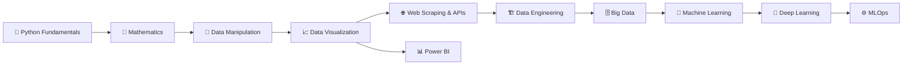

<div align="center">

# 📊 Data Science Cheat Sheet

### A structured, all-in-one reference for Data Science — from Python fundamentals to Machine Learning & MLOps

[](https://git.io/typing-svg)


</div>

---

## 📖 About This Repo

This repository is my **personal Data Science reference library** — a growing collection of notes, cheat sheets, and hands-on notebooks covering everything from Python basics to Machine Learning and MLOps.

> 🎯 **Goal:** Build a single, well-organized place to quickly look things up, refresh concepts, and reference working code — instead of re-searching the same things over and over.

Every folder is self-contained with its own `README.md`, so you can jump straight to the topic you need.

---

## 🗺️ Roadmap

A suggested learning path through this repo, from foundations to advanced topics:

```
 1️⃣  Python Fundamentals      →  Learn the language itself
 2️⃣  Mathematics               →  Build the theoretical foundation (Calculus, Linear Algebra, Statistics)
 3️⃣  Data Manipulation         →  NumPy & Pandas for working with data
 4️⃣  Data Visualization        →  Matplotlib & Seaborn to see your data
 5️⃣  Web Scraping & APIs       →  Collect your own data from the web
 6️⃣  Data Engineering          →  Store, move, and prepare data at scale
 7️⃣  Big Data                  →  Work with data beyond a single machine
 8️⃣  Machine Learning          →  Build & interpret predictive models
 9️⃣  Deep Learning             →  Neural networks & advanced modeling
 🔟  MLOps                     →  Deploy, monitor & maintain ML in production
 📊  Power BI                  →  Turn insights into dashboards & reports
```



---

## 📂 Folder Overview

| Folder | Description |
|---|---|
| 🐍 **Python Fundamentals** | Core Python concepts — syntax, data types, functions, OOP, iterators, generators, decorators, type hinting, and common errors. |
| 📐 **Mathematics** | The math behind data science — Calculus, Linear Algebra, Statistics & Probability, and Advanced Statistics. |
| 🧮 **Data Manipulation** | Working with data using **NumPy** (arrays) and **Pandas** (DataFrames). |
| 📈 **Data Visualization** | Creating charts and plots with **Matplotlib** and **Seaborn**. |
| 🌐 **Web Scraping & APIs** | Collecting data from the web using **Requests** and **BeautifulSoup**. |
| 🏗️ **Data Engineering** | Building data pipelines, working with databases (e.g. PostgreSQL), and preparing data for analysis. |
| 🗄️ **Big Data** | Concepts and tools for handling large-scale datasets. |
| 🤖 **Machine Learning** | Building, evaluating, and interpreting ML models with **scikit-learn** and **SHAP**. |
| 🧠 **Deep Learning** | Neural networks and deep learning fundamentals. |
| ⚙️ **MLOps** | Deploying, monitoring, and maintaining machine learning models in production. |
| 📊 **Power BI** | Building interactive dashboards and reports, plus DAX formulas. |

---

## 🎥 Featured Learning Resources

| Topic | Resource |
|---|---|
| 🐍 Python | [Introduction to Python — W3Schools](https://www.w3schools.com/python/python_intro.asp) · [Python Tutorial (Video)](https://youtu.be/mvZHDpCHphk?si=bgw9KSeN3p3nOuij) |
| 🧮 NumPy | [NumPy Tutorial — W3Schools](https://www.w3schools.com/python/numpy/default.asp) |
| 🧮 Pandas | [Pandas Tutorial — GeeksforGeeks](https://www.geeksforgeeks.org/pandas/pandas-tutorial/) |
| 🏗️ PostgreSQL | [PostgreSQL Tutorial — W3Schools](https://www.w3schools.com/postgresql/index.php) · [PostgreSQL Tutorial (Video)](https://youtu.be/us1rf2iynOY?si=jyRr8H6H7HFgJqYk) |
| 🤖 Machine Learning | [Machine Learning Tutorial — GeeksforGeeks](https://www.geeksforgeeks.org/machine-learning/machine-learning/) |
| 📊 Power BI | [Power BI Tutorial (Video)](https://youtu.be/FwjaHCVNBWA?si=NKhn0iHWZx90tG9W) · [Power BI Tutorial (Video)](https://youtu.be/WdCltDhmRLo?si=IYPBUdzFWyIdLNnt) |

> 💡 Each folder's own `README.md` contains more focused resources and a breakdown of its files.

---

## ✅ How to Use This Repo

1. Pick a topic from the **Roadmap** or **Folder Overview** above.
2. Open that folder's `README.md` for a breakdown of what's inside.
3. Run the notebooks/scripts locally (most require `pip install` + Jupyter — see each folder's README for exact setup steps).
4. Use it as a **reference**, not a course — jump to whatever you need, whenever you need it.

---

## 🤝 Using AI as a Learning Companion

You don't need to memorize everything in here. Use AI tools like **ChatGPT** or **Claude** to:
- Explain any function, parameter, or concept in more depth.
- Debug code or clarify error messages.
- Suggest related concepts worth exploring next.

---

<div align="center">

### ⭐ If this repo helps you, consider giving it a star!

</div>